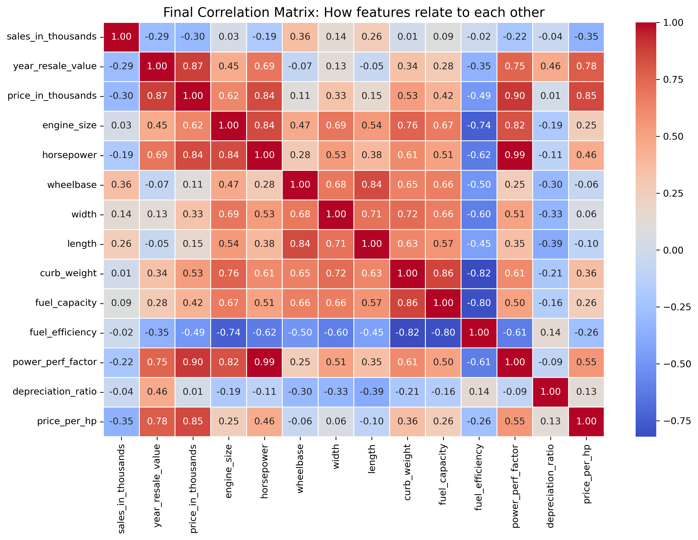

# Automotive Market Analysis & EDA

Uncovering the Drivers of Price, Performance, and Efficiency

##   Project Overview

* This project is a deep dive into a dataset of vehicle specifications and sales. Using Python, I performed Exploratory Data Analysis (EDA) to understand how mechanical features like Horsepower and Weight influence a car's market price and fuel economy.

##   Tech Stack

* Language: Python 3.x
* Libraries: Pandas (Data Wrangling), NumPy (Math), Matplotlib & Seaborn (Data Visualization)
* Environment: Jupyter Notebook

##  Key Discoveries & Insights

**1. Mechanical Redundancy (r = 0.99)**
* Analysis revealed a nearly perfect positive correlation between Horsepower and the Power Performance Factor.
* Insight: These two variables provide identical information. In a machine learning context, one of these should be dropped to prevent overfitting or redundancy.

**2. The Weight vs. Efficiency Trade-off (r = -0.82)**
* There is a strong negative correlation between Curb Weight and Fuel Efficiency.
* Insight: Physics dictates the market. As vehicle weight increases, miles-per-gallon (MPG) drops predictably. This highlights the engineering challenge of balancing vehicle size with environmental standards.

**3. Price & Fuel Economy (r = -0.49)**
* A moderate negative correlation exists between Price and Fuel Efficiency.
* Insight: Luxury and performance usually come at the cost of efficiency. However, the moderate score suggests a growing segment of **High-Efficiency Premium** vehicles (likely Hybrids/EVs) that break this traditional trend.

**4. Brand Value Retention**
* By engineering a custom depreciation_ratio, I identified which manufacturers hold their value best.
* Insight: Plymouth leads the pack in value retention, making it a safer financial investment for consumers.

##   Workflow
* **Cleaning**: I standardized column names, handled missing values via manufacturer-specific medians, and removed outliers.
* **Feature Engineering**: I created price_per_hp, is_high_perf?(Categorical Flag), and depreciation_ratio to quantify long-term value.
* **Exploration**: Used Histograms for distribution analysis and Scatter Plots for relationship testing.
* **Correlation**: Developed a comprehensive Heatmap to validate all numerical relationships.

##   Next Steps
* With the EDA complete, the next phase of this project involves building a Linear Regression model to predict a vehicle's Resale Value based on its mechanical specifications.
